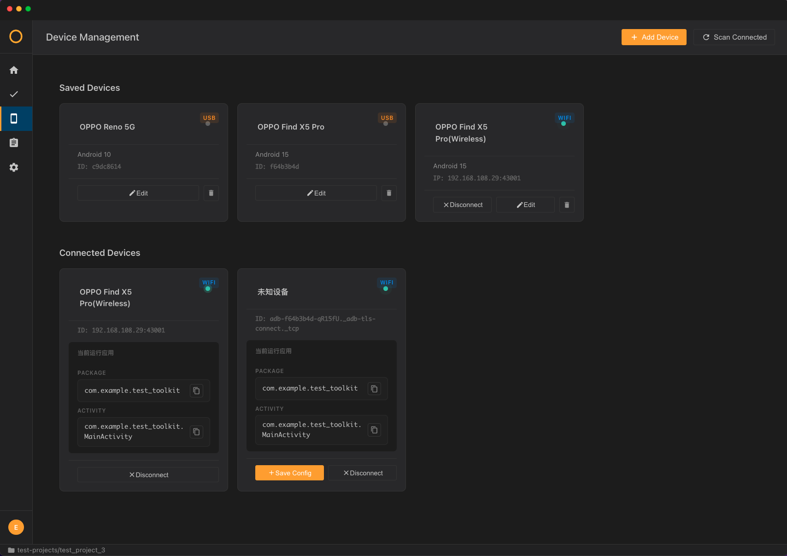
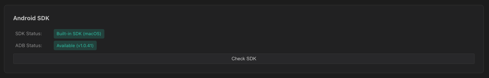

<div align="center">


# Toolkit Studio

**深度融合AI的UI自动化测试脚本编写集成开发环境**

[](https://github.com)
[](https://github.com)

[English](README_EN.md) | 简体中文

</div>


## 核心特性

<table>
<tr>
<td width="50%">

### 项目管理
自动创建结构化测试项目文件夹,从CSV导入测试用例

*(未来支持从 Notion, GitHub 或 Toolkit云盘 同步)*

</td>
<td width="50%">

### AI仿生测试
允许AI观察App并与设备交互,能够根据测试需求初步进行无监督测试,并且自动记录为自动化脚本供后续审查与修订

</td>
</tr>
<tr>
<td>

### 脚本编辑
自动化编辑器,支持语法高亮和多标签,运行时实时反馈运行步骤和失败位置

</td>
<td>

### 设备连接
多设备管理,实时状态检测和屏幕预览

</td>
</tr>
<tr>
<td>

### 元素定位
点击屏幕获取元素,查看XML结构,并直接根据获取的元素创建自动化脚本

</td>
<td>

### AI智能修正 
App版本更新后,运行旧脚本时遇到问题,可以开启AI辅助驾驶,AI会根据页面环境自动判断和修正当前脚本中存在的元素定位缺失/偏移等问题

</td>
</tr>
</table>


## 功能演示

### 海量测试用例,一键导入

<div align="center">

</div>

### XML、截图、坐标点,三种识别模式随心搭配

<div align="center">

</div>

### 拖拽交互,轻松生成自动化脚本

<div align="center">

</div>

### 块编辑器 ⇄ 文本编辑器,一键切换

<div align="center">

</div>

### ToolkitScript 自创脚本语言,简单易懂

<div align="center">

</div>

> **Toolkit Script** 是本项目使用的自定义自动化测试脚本语言,对应脚本文件后缀为 `.tks`
>
> 语法规范可以参考 [Toolkit Script语法规范v1.0.0](./docs/The_ToolkitScript_Reference.md)

### 运行用例,逐行高亮追踪

<div align="center">

</div>

### 设备无线连接,消除USB接口焦虑

<div align="center">

</div>

### 流式日志抓取,辅助测试排查

<div align="center">

</div>

### 内置全套AndroidSDK,即装即用

<div align="center">

</div>

### .tks引擎,效率翻倍

<div align="center">

</div>


## 测试项目结构

测试项目的基础目录结构:

```
project_root/
├── cases/              # 测试用例文件夹
│   └── case_001/
│       ├── config.json # 此用例配置
│       ├── result/     # 此用例下脚本运行log结果存放处
│       └── script/     # 测试脚本
│           └── script_001.yaml
├── devices/            # 设备配置
├── locator/            # 元素定位材料
│   ├── element.json    # xml 元素定位信息
│   └── img/            # 裁切截图 图像识别元素定位信息
├── testcase_map.json   # 用例映射表
├── testcase_sheet.csv  # 用例总表
└── workarea/           # 当前工作区
    ├── current_screenshot.png    # 当前设备屏幕截图
    └── current_ui_tree.xml       # 当前设备屏幕xml UI树信息
```


## 快捷键

| 快捷键 | 功能 |
|--------|------|
| `Cmd/Ctrl + S` | 保存 |
| `Cmd/Ctrl + W` | 关闭Tab页 |
| `Ctrl + Tab` | 下一个tab |
| `Ctrl + Shift + Tab` | 上一个tab |


## 常见问题


<details>
<summary><b>设备未检测到</b></summary>

1. 开启手机开发者选项
2. 开启USB调试
3. USB连接设备
4. 授权调试请求

</details>

<details>
<summary><b>无法获取设备屏幕</b></summary>

1. 检查设备是否正确连接
2. 重新插拔USB线
3. 扫描全部设备

</details>


<div align="center">

**Test Toolkit**

</div>
