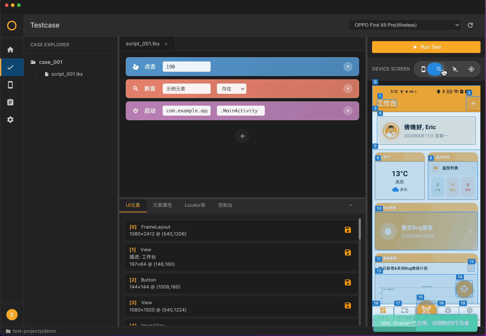
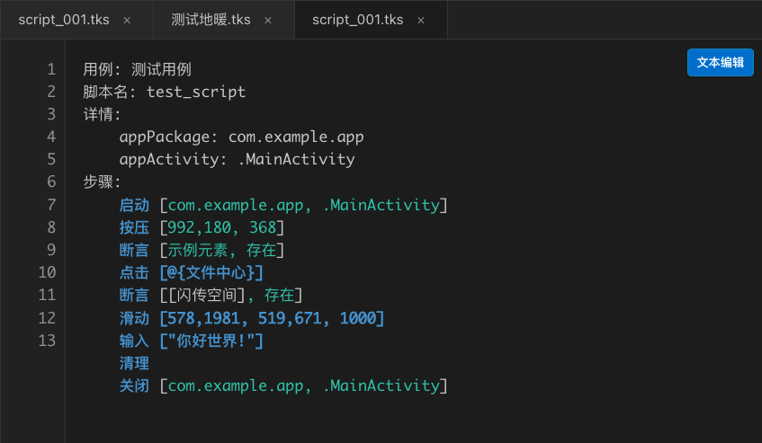

## Toolkit Studio Homepage Feature Present

## Logo:

主题色: #fe7600

背景色: 深色黑色

风格: 类似Jetbrains IDE的IDE风格

## 定义

产品叫  Toolkit Studio (测试工具箱Studio)
是测试工具箱系列产品, 深度融合AI的UI自动化测试脚本编写集成开发环境与自动化测试执行环境

## 主要功能

- **项目管理**：自动创建结构化测试项目文件夹，从CSV导入测试用例(未来支持从 Notion, GitHub 或 Toolkit云盘 同步)
- **AI仿生测试**: 允许AI通过此集成环境观察App和并与设备交互, 能够根据测试需求初步进行无监督测试, 并且自动记录为自动化脚本供后续审查与修订
- **脚本编辑**：自动化编辑器，支持语法高亮和多标签, 运行时实时反馈运行步骤和失败位置
- **设备连接**：多设备设备管理，实时状态检测和屏幕预览
- **元素定位**：点击屏幕获取元素，查看XML结构, 并直接根据获取的元素创建自动化脚本
- **测试执行**：运行测试脚本，查看执行日志
- **AI修正**: App版本更新后, 运行旧脚本时遇到问题, 可以开启AI辅助驾驶, AI会根据页面环境自动判断和修正当前脚本中存在的元素定位缺失/偏移等问题

## 功能展示

### 海量测试用例, 一键导入; 创建用例, 搭建团队专属工作区

### XML, 截图, 坐标点, 三种识别模式随心搭配, 可见即可得

### 拖拽交互, 轻松生成自动化脚本

### 块编辑器 or 文本编辑器, 一键切换

### ToolkitScript 自创脚本语言, 简单易懂

### 运行用例, 逐行高亮追踪; 出错标红, 方便定位错误

### 设备无线连接, 消除USB接口焦虑

### 流式日志抓取, 辅助日常测试排查和与开发联调

### 内置全套AndroidSDK, 摆脱繁琐环境配置, 即装即用

### .tks引擎, 跨越传统自动化测试三层封装, 效率翻倍

## 未来功能

1.   使用AI理解测试用例, 识别屏幕, 通过Toolkit Studio与手机进行交互, 并记录执行的步骤, 直接将执行过的步骤保存为.tks脚本; 以供大规模批量获得.tks自动化脚本, 省去编写脚本的时间
2.   使用AI辅助驾驶, 提高.tks自动化脚本的鲁棒性, 当UI有小范围变动, 或文案随使用中更改后, 导致某个脚本步骤中的locator无法被精准的定位到时, 仍能够通过LLM模型的理解能力, 在页面中找到相似的元素, 执行相同的操作, 不影响自动化用例的整体执行
