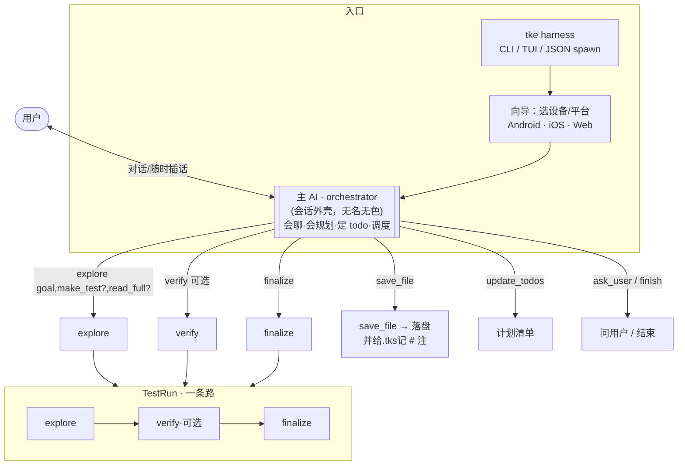
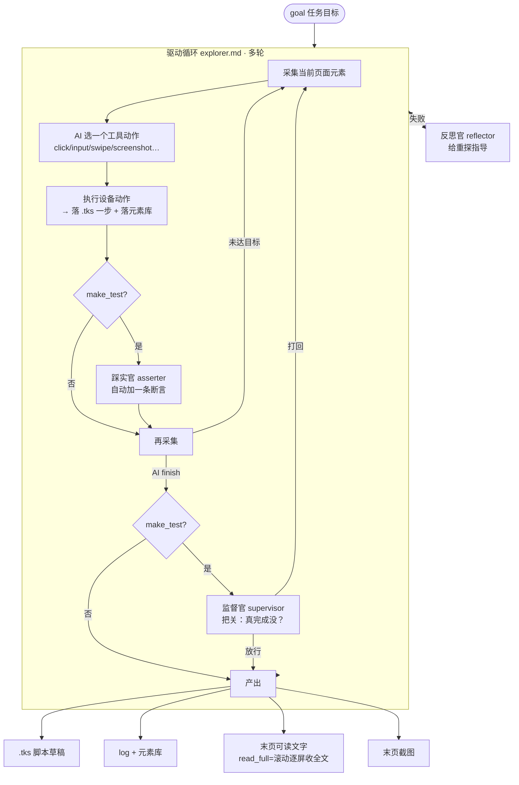

# tke 当前流程（通用设备 AI agent）

> tke = 一个 **CLI/TUI/JSON-spawn 的、操作 安卓/iOS/web 的对话式 AI agent**。
> 测试只是它的一种用法——**测试任务和一般任务走同一套**，唯一区别是「要不要可回放校验」。

## 一句话

> 用户对话 → **主 AI（orchestrator）** 判断要做什么 → 调 `explore` 驱动设备（始终产 .tks/log/元素 + 返回末页文字/截图）→ 一般任务用结果答复/存文件；测试任务再 `verify` 校验 → `finalize` 收尾。

---

## 顶层编排

---

## explore 内部（驱动循环 = 测试和通用共用的同一套）

`verify`（**仅** make_test 的测试）：脚本医生 doctor 回放→修复 + 稳定性回放 + 优化官 optimizer 删冗余。
`finalize`：定稿语义命名 + 提交正式元素库 + 结果框；把 `save_file` 等非设备动作作为 `# 注：…` 追加到 .tks 末尾（回放跳过）。

---

## 两种用法 = 同一条路，只差 make_test / verify

| | 一般任务（看内容 / 截图 / 存文件） | 测试任务（要可回放可验证脚本） |
|---|---|---|
| explore | `make_test=false`（默认，轻） | `make_test=true` |
| 踩实官+监督官 | 跳过 | 开 |
| verify | 不调 | 调（医生修复+稳定性） |
| 产物 | .tks（只设备动作）+log+元素 **+末页文字/截图** | 同样的 .tks/log/元素，且经校验稳定 |
| 交付 | 用末页文字/截图 → `save_file` 或直接答复 | 定稿的 .tks 脚本 |

**例 1 · 把 policy 存成 md**
`explore{goal:"进隐私政策页", read_full:true}` → 拿回全文 → `save_file{policy.md}` → `finalize`
（.tks 里是导航步 + 末尾 `# 注：保存文件 policy.md`）

**例 2 · 截用户头像**
`explore{goal:"找到用户头像并停在那"}` → 拿回末页截图路径 → 交付 → `finalize`

**例 3 · 测一条登录流程**
`explore{goal:"...", make_test:true}` → `verify` → `finalize`

---

## agent 分层（盘清后）

| 层 | agent | 形态 | 何时用 |
|---|---|---|---|
| **通用层** | orchestrator（主AI） | 多轮·会话 | 始终 |
| | 驱动 agent（explorer.md） | 多轮·带工具 | 始终（一套提示词，测试+通用共用） |
| **测试专长零件** （只为可回放脚本服务，非 make_test 时跳过） | doctor 脚本医生 | 多轮·带工具 | verify 修复 |
| | optimizer 优化官 | 多轮·带工具 | 删冗余 |
| | reflector 反思官 | 单次·JSON | 失败重探指导 / 定稿命名 |
| | supervisor 监督官 | 单次·JSON | finish 把关 |
| | asserter 踩实官 | 单次·JSON | 每步自动断言 |

判据：**会进 flow 多轮循环 = 多轮带工具；问一次答一次 = 单次 JSON。**

---

## 其它一直生效的底座

- **每次 LLM 调用都开深度思考**（供应商无关 reasoning，默认 medium；anthropic 走 sonnet-4-6 / openai 走 gpt-5.5-mini）。
- **回放元素消歧**：每个元素存 `anchor`（探索时的框，仅 tiebreak），同名多命中时回放选离它最近的那个，治"点错同名 + 断言假阳性"。
- **三前端解耦**：引擎只发 `UiEvent`，Plain / JSON(被 app spawn) / TUI 各自渲染；用户指令经 `UiCommand` 随时插话。
