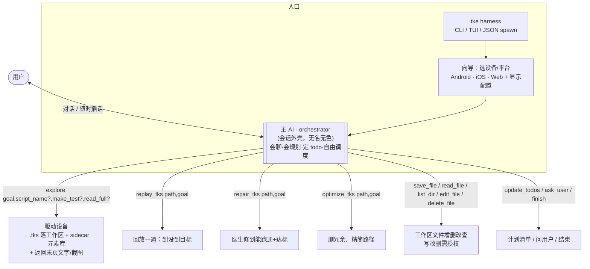
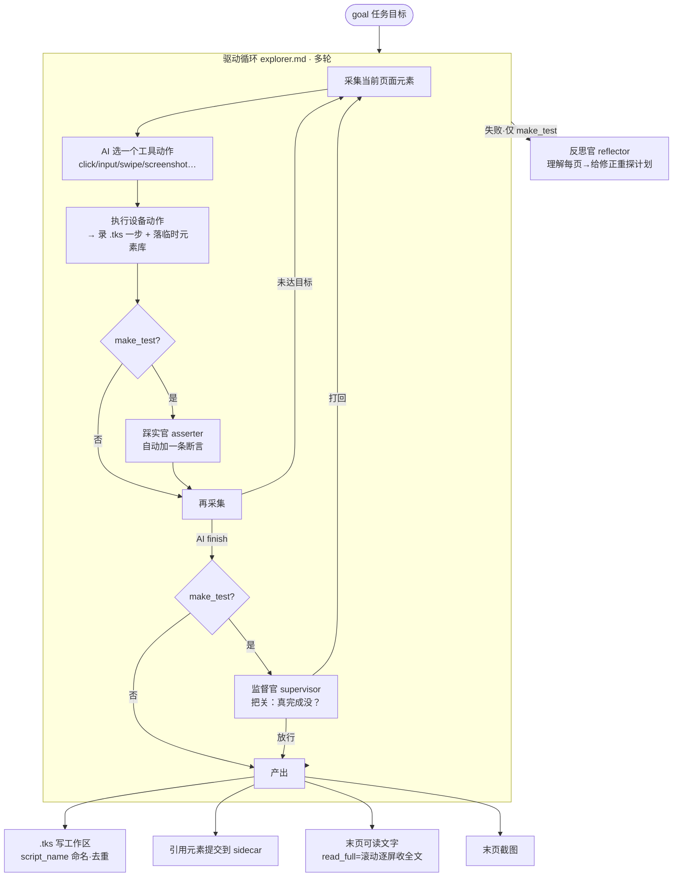

# tke 当前流程（工作区式设备 AI agent）

> tke = 一个 **CLI/TUI/JSON-spawn 的、操作 安卓/iOS/web 的对话式 AI agent**，形态像 coding agent（Claude Code / opencode）。
> 测试只是它的一种用法：把在设备上走的流程录成可回放的 `.tks` 脚本。一般任务（读内容/截图/存文件/梳理结构）走同一套。

## 一句话

> 用户对话 → **主 AI（orchestrator）** 自由调度**颗粒化工具**：`explore` 驱动设备把过程录成 `.tks`（落工作区、AI 命名、可多个），再按需 `replay_tks`/`repair_tks`/`optimize_tks` 打磨；配 `save_file`/`read_file`/`edit_file` 等文件操作。**没有固定流水线**——想要高质量脚本时才照"建议流程"走。

---

## 顶层编排

**关键：没有常驻运行态。** `.tks` 都是工作区里独立的文件；explore 产出后即时落盘，之后 replay/repair/optimize 都**按文件路径**操作。一次对话可产多个脚本、在同一个上反复打磨、混着读写文件。

---

## 三类文件，各落各处

| 类型 | 落点 | 由谁定 |
|---|---|---|
| **交付文件**（save_file 存的 md 等）+ **`.tks` 脚本** + **sidecar 元素库** | **工作区**（`--current-dir` 或进程当前目录） | `Params::workspace_root()` |
| **运行中间文件**（截图/页面结构/会话日志/临时元素库） | **cache**（`--cache` 或系统临时目录 `tke/cache`），不展示给用户 | `Params::cache_root()` |

- **sidecar 元素库**：`foo.tks` ↔ `foo.elements.json`（自包含、可单独搬走；缺则回退默认共享库）。
- **`--current-dir`**：CLI/TUI 不传就用当前目录（`cd` 到哪算哪）；**app spawn 传项目目录**即可，不用改 spawn CWD。
- 已**去掉 `--scripts`**（脚本不再写死单一输出目录）。

---

## explore 内部（驱动循环 = 测试和一般任务共用一套）

- `make_test=true`：开踩实官（每步自动断言）+ 监督官（finish 把关）+ 失败重探，脚本更适合之后 replay/repair；`false`（默认）走轻模式，脚本只有设备动作。
- `read_full=true`：驱动只导航到内容页，系统**自动逐屏收全文**返回（别让驱动滚着读）。
- 探索草稿/临时元素库落 cache；最终 `.tks` + sidecar 由收尾写到工作区（**总是落盘**，哪怕没完全达成，留下可被 `repair_tks` 修的脚本）。

---

## 没有固定流水线，只有"建议流程"

- **一般任务**（读内容/截图/存文件）：`explore` → 用返回的末页文字/截图 `save_file` 落盘或直接答复。脚本是副产物。
- **要高质量、可反复回放的测试脚本**（建议，非必须）：
  1. `explore{make_test:true}` 产草稿 → 2. `replay_tks` 跑基线 → 3. `optimize_tks` 精简 → 4. `repair_tks` 把跑挂的修回 → 5. 再 `replay_tks` 一两次确认**稳定**。
  按需取舍：只想要能跑的，explore + replay 确认即可。**用户有自己想法就按用户的来。**

> 注：老的"医生⇄反思官交替自动收敛"(`verify_and_repair`) 已移除（真机效果差）；改由主 AI 自己编排 repair + optimize + replay。

---

## 工具一览

| 工具 | 作用 | 授权 |
|---|---|---|
| `explore{goal, script_name?, make_test?, read_full?}` | 驱动设备录 .tks 到工作区 + sidecar，返回末页文字/截图 | — |
| `replay_tks{path, goal}` | 回放一遍，报到没到目标/哪失败（基线/稳定性）。不改脚本 | — |
| `repair_tks{path, goal}` | 医生回放→修到能跑通+达标，写回 .tks | — |
| `optimize_tks{path, goal}` | 删绕路/冗余步，写回 .tks（改完建议再 replay） | — |
| `save_file{filename, content}` | 写文件到工作区（可子目录）；返回绝对路径，须转告用户 | **需授权** |
| `read_file{path}` / `list_dir{path?}` | 读文件 / 列目录 | 免授权 |
| `edit_file{path, old_string, new_string}` | 唯一串替换 | **需授权** |
| `delete_file{path}` | 删文件 | **需授权** |
| `update_todos` / `ask_user` / `finish` | 计划清单 / 反问 / 结束 | — |

**授权流（仿 opencode）**：写/改/删弹三选项 **允许一次 / 本次会话都允许 / 拒绝**；"本次都允许"按类别（write/edit/delete）记进会话；拒绝→回灌让 AI 换做法。非交互前端（app spawn / CI）自动放行。

---

## agent 分层

| 层 | agent | 形态 | 何时用 |
|---|---|---|---|
| **通用层** | orchestrator（主AI） | 多轮·会话 | 始终 |
| | 驱动 agent（explorer.md） | 多轮·带工具 | explore（测试+一般共用一套提示词） |
| **测试专长零件** （只为可回放脚本服务） | doctor 脚本医生 | 多轮·带工具 | `repair_tks` 修复 |
| | optimizer 优化官 | 多轮·带工具 | `optimize_tks` 删冗余 |
| | reflector 反思官 | 单次·JSON | 失败重探（理解每页→修正计划）/ 定稿命名 |
| | supervisor 监督官 | 单次·JSON | make_test 时 finish 把关 |
| | asserter 踩实官 | 单次·JSON | make_test 时每步自动断言 |

判据：**会进 flow 多轮循环 = 多轮带工具；问一次答一次 = 单次 JSON。**

---

## 一直生效的底座

- **每次 LLM 调用都开深度思考**（供应商无关 reasoning，默认 medium；anthropic 走 sonnet-4-6 / openai 走 gpt-5.5-mini）。
- **回放元素消歧**：每个元素存 `anchor`（探索时的框，仅 tiebreak），同名多命中时回放选离它最近的那个，治"点错同名 + 断言假阳性"。
- **三前端解耦**：引擎只发 `UiEvent`，Plain / JSON(被 app spawn) / TUI 各自渲染；用户指令经 `UiCommand` 随时插话。
- **全局参数**：`--current-dir`（工作区根）· `--cache`（中间文件）· `--model/--ai-*`（模型）· `--reasoning-effort` · `--ocr`。
