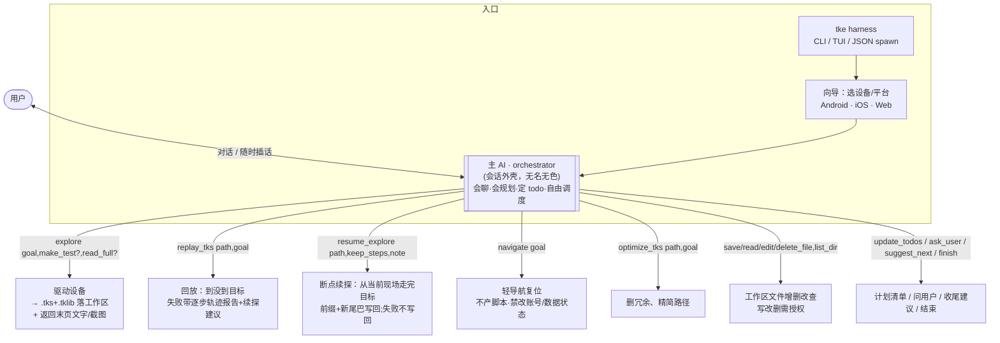

# tke 当前流程（工作区式设备 AI agent）

> tke = 一个 **CLI/TUI/JSON-spawn 的、操作 安卓/iOS/web 的对话式 AI agent**，形态像 coding agent（Claude Code / opencode）。
> 测试只是它的一种用法：把在设备上走的流程录成可回放的 `.tks` 脚本。一般任务（读内容/截图/存文件/梳理结构）走同一套。
> 模块职责见 `../AGENTS.md`；为什么长这样见 `adr/`（本图速览，冲突时以代码为准）。

## 一句话

> 用户对话 → **主 AI（orchestrator）** 自由调度**颗粒化工具**：`explore` 驱动设备把过程录成 `.tks + .tklib` 两件套（落工作区、AI 命名、可多个），再按需 `replay_tks`（回放+失败报告）→ 判断（`resume_explore` 续探修 / `navigate` 复位 / 问用户）→ `optimize_tks` 打磨；配 `save_file`/`read_file`/`edit_file` 等文件操作。**没有固定流水线、没有一键黑盒修复**（INV-3）。

---

## 顶层编排

**关键：没有常驻运行态。** `.tks` 都是工作区里独立的文件；explore 产出后即时落盘，之后一切按文件路径操作。修复闭环 = `replay_tks`（轨迹报告）→ 编排官判断 → `navigate` 复位（如起始态没对齐）→ `resume_explore` → `replay_tks` 验证——决策留在对话层。

---

## 文件落点

| 类型 | 落点 | 由谁定 |
|---|---|---|
| **交付文件**（save_file）+ **两件套**（`foo.tks + foo.tklib`） | **工作区**（`--current-dir` 或进程当前目录） | `Params::workspace_root()` |
| **运行中间文件**（截图/页面结构/会话日志/解包临时库） | **cache**（`--cache` 或系统临时目录），不展示给用户 | `Params::cache_root()` |

- **两件套自包含**（ADR-0003）：`foo.tklib` = zip（meta + element.json + img/），拷走即跑。**没有共享元素库**。
- `--current-dir`：CLI/TUI 不传就用当前目录；app spawn 传项目目录。

---

## explore 内部（驱动循环 = 测试和一般任务共用一套）

```mermaid
flowchart TD
    G([goal]) --> D
    subgraph D[驱动循环 explorer.md · 多轮 · 接地在实时页面]
      direction TB
      C[采集当前页面元素] --> A[AI 选一个工具动作] --> X[执行设备动作<br/>→ 录 .tks 一步 + 落临时元素库]
      X --> CK{make_test?} -->|是| AS[踩实官 asserter 自动断言] --> C2[再采集]
      CK -->|否| C2
      C2 -->|未达目标| C
      C2 -->|AI finish| FCK{make_test?} -->|是| SUP[监督官 supervisor 把关] -->|放行| OUT
      FCK -->|否| OUT
      SUP -->|打回| C
      C -.卡住升级:4轮无进展/3次横跳.-> ASK[强制 ask_user 或 finish<br/>提问经参谋 advisor 中转:出选项/托管代答]
    end
    D -->|失败·仅 make_test| RF[反思官 reflector<br/>给编号的修正重探计划] --> D
    D --> OUT[finalize 产出]
    OUT --> W1[.tks + .tklib 写工作区]
    OUT --> W2[页面契约:pages 实体落包<br/>首尾插「断言页面」步 ADR-0004]
    OUT --> W3[末页文字/截图返回编排官]
```

- `make_test=true`：踩实官+监督官+失败重探，脚本适合之后回放打磨；`false`（默认轻模式）只录设备动作（也落标志，回放起点仍可校验）。
- `read_full=true`：驱动只导航到内容页，系统自动逐屏收全文（别让驱动滚着读）。

---

## tke run（无 AI 回放 + AI 辅助驾驶）

`tke run foo.tks` 是纯回放（App/CI 用）。copilot（默认开）加三样，**全都不改 .tks/.tklib**（ADR-0006）：

1. **起始态对齐**（开跑前）：本地页面投票 → 不在起始页则 `navigate` 导航回去 → 实测复验，失败拒跑
2. **定位自愈**（步内）：元素定位失败→单次 LLM 按当前页面"找回它"，救活本步继续
3. **分诊**（自愈也不行时）：同页替代救活 / 前步走偏 / 路径重构 / App 缺陷——后三类只出诊断进报错

报告：`step_end.healed` / `run_end.healed` / 终端 🩹 标注。登录态等前提只诊断不代办（INV-12）。

---

## agent 分层

| 层 | agent | 形态 |
|---|---|---|
| **通用层** | orchestrator（主AI） | 多轮·会话 |
| | explorer（驱动） | 多轮·带工具（测试+一般任务同一套提示词） |
| **测试零件** | optimizer 优化官 | 多轮·带工具 |
| **单次角色**（oneshot 强制工具调用，ADR-0005） | asserter 踩实 / supervisor 把关 / reflector 反思 / healer 自愈 / advisor 参谋 / verify(marker) | 单次·schema 校验 |

判据：**多轮必须接地在真实状态（INV-1）；问一次答一次 = oneshot**。
（旧「医生」多轮编辑脚本文本不接地，已整体删除——ADR-0001，别复活它。）

---

## 一直生效的底座

- **每次 LLM 调用开深度思考**（供应商无关 reasoning，默认 medium；anthropic 需 sonnet-4-6+，见 PITFALLS P-04）。
- **回放元素消歧**：Locator 带 anchor（仅 tiebreak），同名多命中选最近；web 另有唯一 DOM 路径（P-11）。
- **三前端解耦**（ADR-0007）：引擎只发 `UiEvent`，Plain(stderr) / JSON(stdout NDJSON 给 app) / TUI 各自渲染；提问/授权按前端能力（`supports_prompts()`），非交互自动代答/放行。
- **全局参数**：`--current-dir` · `--cache` · `--copilot` · `--config` · `--json` · `-d`。
